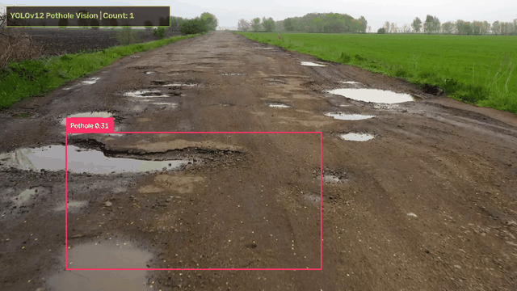
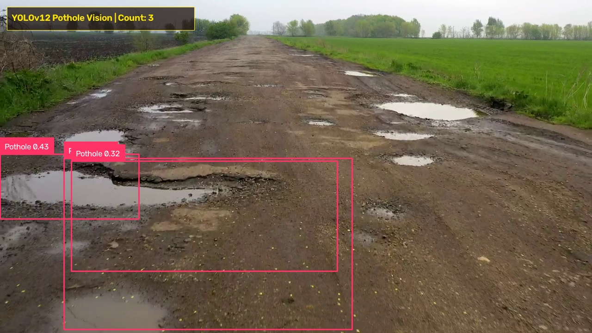

<div align="center">

# 🛣️ YOLOv12 Pothole Vision Engine
### Real-Time Road Distress Analysis & Intelligent Detection Dashboard

[](https://python.org)
[-00e5ff.svg?logo=opencv&logoColor=white)](https://github.com/sunsmarterjie/yolov12)
[](https://ultralytics.com)
[](https://roboflow.com)
[](https://flask.palletsprojects.com)
[](LICENSE)

<p align="center">
  <b>An end-to-end computer vision platform designed to detect, track, and analyze road potholes in real time from dashcam or vehicle cameras using state-of-the-art YOLOv12 Area Attention models.</b>
</p>

---

### 🎬 Live Execution Demo



*Full execution video available at: [`execution_demo.mp4`](execution_demo.mp4)*

</div>

---

## 📸 Detection Sample

<div align="center">
  
  <p><i>Real-time bounding box localization, confidence scoring, and multi-pothole identification.</i></p>
</div>

---

## ✨ Key Features

- **⚡ YOLOv12 Attention-Centric Architecture**: Employs YOLOv12 Small (`yolov12s`) with Area Attention (`AAttn`), offering heightened feature perception across complex asphalt textures, rain puddles, and varying road shadows.
- **🔄 Universal Architecture Compatibility**: Includes a custom runtime patch that resolves the `AAttn` layer refactoring in modern Ultralytics (`qk`/`v` vs legacy `qkv`), allowing zero-crash execution across all environment versions.
- **🎛️ Live Interactive Dashboard**: Cybernetic dark-mode web console with responsive UI, real-time FPS throughput counter, and inference latency telemetry (~89ms on standard CPU).
- **🎚️ Dynamic Sensitivity Slider**: Fine-tune detection confidence thresholds (`0.10` to `0.90`) in real time via live API without restarting the stream.
- **📤 Drag & Drop Video Upload**: Upload custom dashcam or phone footage (`.mp4`, `.avi`, `.mov`, `.mkv`) directly in the browser; the engine buffers and switches feeds on the fly.
- **🔁 Non-Stop Looping Engine**: Auto-restarts videos upon completion for continuous monitoring and kiosk displays.

---

## 🗂️ Project Structure

```text
├── assets/
│   ├── demo_preview.gif         # Animated demonstration for documentation
│   └── detection_sample.jpg     # High-resolution detection frame
├── Templates/
│   └── index.html               # Cybernetic dark-mode web dashboard
├── uploads/                     # Storage for user-uploaded custom videos
│   └── .gitkeep
├── app.py                       # Main Flask server, YOLOv12 patch & streaming engine
├── best.pt                      # Trained YOLOv12s pothole detection checkpoint
├── demo.mp4                     # Default road evaluation footage
├── execution_demo.mp4           # Rendered execution video with telemetry HUD
├── kaggle_dataset_downloader.py # Automated Kaggle dataset fetcher
├── requirements.txt             # Project dependencies
└── README.md                    # Project documentation
```

---

## 🚀 Quickstart & Installation

### 1. Clone the Repository
```bash
git clone https://github.com/Saket745/Pothole-Detection-with-computer-vision.git
cd Pothole-Detection-with-computer-vision
```

### 2. Create and Activate Virtual Environment
```bash
# Windows
python -m venv venv
.\venv\Scripts\activate

# Linux / macOS
python3 -m venv venv
source venv/bin/activate
```

### 3. Install Dependencies
```bash
pip install -r requirements.txt
```

### 4. Launch the Application
```bash
python app.py
```
Open your browser and navigate to:
```text
http://127.0.0.1:5000
```

---

## 🌐 Kaggle Integration & Datasets

### 📥 1. Automated Dataset Downloading
You can fetch high-quality pothole benchmarks directly from Kaggle using the included integration script:

1. Place your `kaggle.json` API token in `~/.kaggle/kaggle.json`.
2. Run the downloader:
```bash
python kaggle_dataset_downloader.py chitholian/annotated-potholes-dataset
```

#### Recommended Kaggle Benchmarks:
- **`chitholian/annotated-potholes-dataset`**: Clean annotated potholes under varying sunlight.
- **`atulyakumar98/pothole-detection-dataset`**: Diverse road and asphalt conditions.
- **Global Road Damage Detection Challenge (RDD2020 / RDD2022)**: Multi-country benchmark covering potholes, alligator cracks, longitudinal cracks, and rutting.

---

### ☁️ 2. Training on Kaggle's Free GPUs (Tesla T4 / P100)
To train or fine-tune YOLOv12 for higher accuracy (50–100 epochs):

```python
# Install Ultralytics in Kaggle Notebook
!pip install ultralytics

from ultralytics import YOLO

# Load base weights
model = YOLO("yolov12s.pt")

# Train on Kaggle GPU
results = model.train(
    data="/kaggle/input/your-pothole-dataset/data.yaml",
    epochs=80,
    imgsz=640,
    batch=16,
    name="yolov12_pothole_run"
)
```
Once training finishes, download `runs/detect/yolov12_pothole_run/weights/best.pt` and replace the local `best.pt`.

---

## 🔌 REST & Streaming APIs

| Endpoint | Method | Description |
| :--- | :--- | :--- |
| `/` | `GET` | Main interactive web dashboard |
| `/video_feed` | `GET` | Multipart MJPEG real-time annotated video stream |
| `/api/stats` | `GET` | Real-time JSON telemetry: `{ detections, fps, latency_ms, confidence, source }` |
| `/api/set_confidence` | `POST` | Dynamic confidence update: `{"confidence": 0.45}` |
| `/api/upload` | `POST` | Multipart upload for road videos (`.mp4`, `.avi`, `.mov`, `.mkv`) |
| `/api/select_video` | `POST` | Switch active stream: `{"video_name": "filename.mp4"}` |
| `/api/videos` | `GET` | List all available stream files |

---

## 🛠️ Built With

- **[YOLOv12](https://github.com/sunsmarterjie/yolov12)** - Area-Attention Object Detection
- **[Ultralytics](https://docs.ultralytics.com/)** - Deep Learning Pipeline Framework
- **[Roboflow Supervision](https://supervision.roboflow.com/)** - Visual Annotation Engine
- **[OpenCV](https://opencv.org/)** - Real-time Video Stream Processing
- **[Flask](https://flask.palletsprojects.com/)** - Web Framework & Microservices

---

## 👤 Author

**Saket Maurya**
- GitHub: [@Saket745](https://github.com/Saket745)
- Email: mauryasaket745@gmail.com

---

## 📄 License
This project is licensed under the MIT License - see the [LICENSE](LICENSE) file for details.
